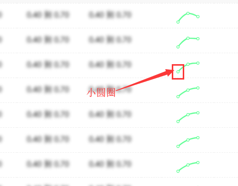
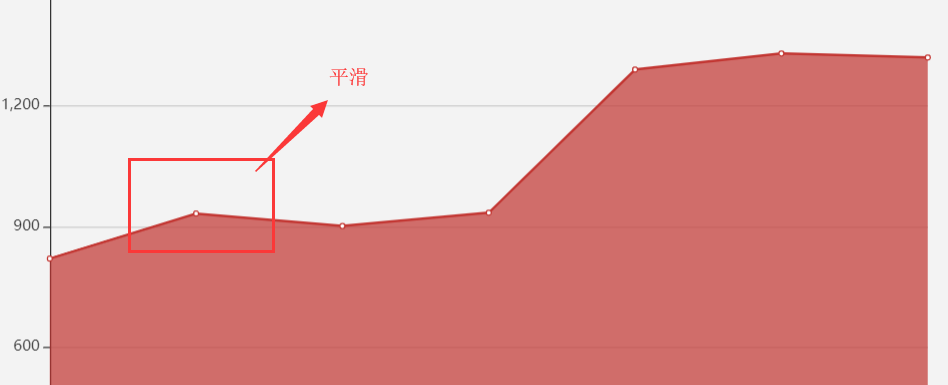

# echarts设置

```js
 option = {
            grid:{         //图表在div中位置
                top: '10%', //顶部距离
                bottom: '10%'//底部距离
            },
            xAxis: {
                type: 'category',
                data: Xdata,
                show:false //x轴是否展示 默认为ture
            },
            yAxis: {
                type: 'value',
                show:false, //y轴是否展示 默认为true
                showSymbol: false,
                max:Ymax,
                min:Ymin
            },
            series: [{
                symbol: "none",//去掉小圆圈
                data: Ydata,
                type: 'line',
                smooth: true,//平滑 , 默认是折线
                color:"#b49dea",
                areaStyle: {     //阴影设置
                    color:'#e3dbf5'  //设置颜色
                },
            }]
        };
```

- 小圆圈

- 阴影

- 平滑
