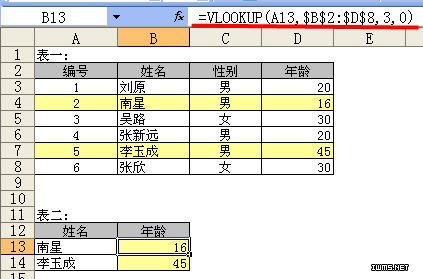

VLOOKUP函数是Excel中几个最重函数之一，为了方便大家学习，兰色幻想特针对VLOOKUP函数的使用和扩展应用，进行一次全面综合的说明。本文为入门部分

   一、入门级

    VLOOKUP是一个查找函数，给定一个查找的目标，它就能从指定的查找区域中查找返回想要查找到的值。它的基本语法为：

    VLOOKUP（查找目标，查找范围，返回值的列数，精确OR模糊查找)

下面以一个实例来介绍一下这四个参数的使用

   例1：如下图所示，要求根据表二中的姓名，查找姓名所对应的年龄。
   

 公式：B13 =VLOOKUP(A13,$B$2:$D$8,3,0)

 参数说明：

     1 查找目标：就是你指定的查找的内容或单元格引用。本例中表二A列的姓名就是查找目标。我们要根据表二的“姓名”在表一中A列进行查找。

      公式：B13 =VLOOKUP(A13,$B$2:$D$8,3,0)

     2 查找范围（VLOOKUP(A13,$B$2:$D$8,3,0) ）：指定了查找目标，如果没有说从哪里查找，EXCEL肯定会很为难。所以下一步我们就要指定从哪个范围中进行查找。VLOOKUP的这第二个参数可以从一个单元格区域中查找，也可以从一个常量数组或内存数组中查找。本例中要从表一中进行查找，那么范围我们要怎么指定呢？这里也是极易出错的地方。大家一定要注意，给定的第二个参数查找范围要符合以下条件才不会出错：

      A 查找目标一定要在该区域的第一列。本例中查找表二的姓名，那么姓名所对应的表一的姓名列，那么表一的姓名列（列）一定要是查找区域的第一列。象本例中，给定的区域要从第二列开始，即$B$2:$D$8，而不能是$A$2:$D$8。因为查找的“姓名”不在$A$2:$D$8区域的第一列。

      B 该区域中一定要包含要返回值所在的列，本例中要返回的值是年龄。年龄列（表一的D列）一定要包括在这个范围内，即：$B$2:$D$8，如果写成$B$2:$C$8就是错的。

     3 返回值的列数（B13 =VLOOKUP(A13,$B$2:$D$8,3,0)）。这是VLOOKUP第3个参数。它是一个整数值。它怎么得来的呢。它是“返回值”在第二个参数给定的区域中的列数。本例中我们要返回的是“年龄”，它是第二个参数查找范围$B$2:$D$8的第3列。这里一定要注意，列数不是在工作表中的列数（不是第4列），而是在查找范围区域的第几列。如果本例中要是查找姓名所对应的性别，第3个参数的值应该设置为多少呢。答案是2。因为性别在$B$2:$D$8的第2列中。

     4 精确OR模糊查找（VLOOKUP(A13,$B$2:$D$8,3,0)  ），最后一个参数是决定函数精确和模糊查找的关键。精确即完全一样，模糊即包含的意思。第4个参数如果指定值是0或FALSE就表示精确查找，而值为1 或TRUE时则表示模糊。这里兰色提醒大家切记切记，在使用VLOOKUP时千万不要把这个参数给漏掉了，如果缺少这个参数默为值为模糊查找，我们就无法精确查找到结果了。  
