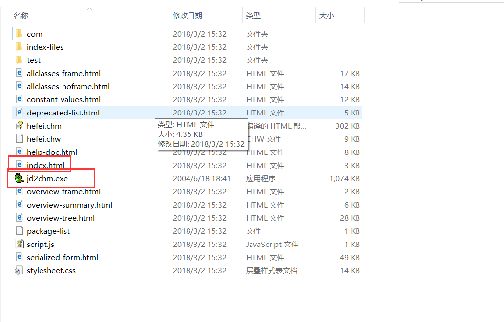
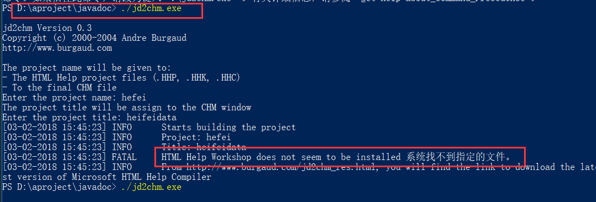
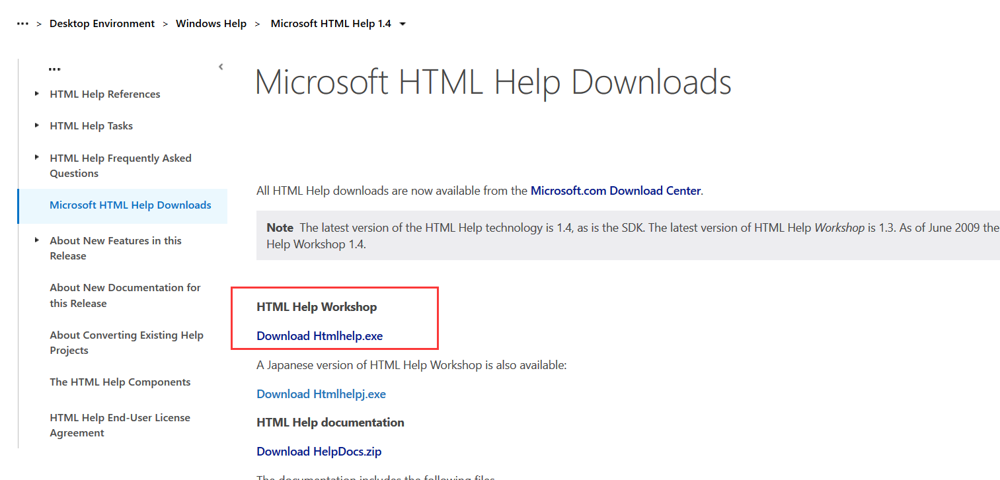
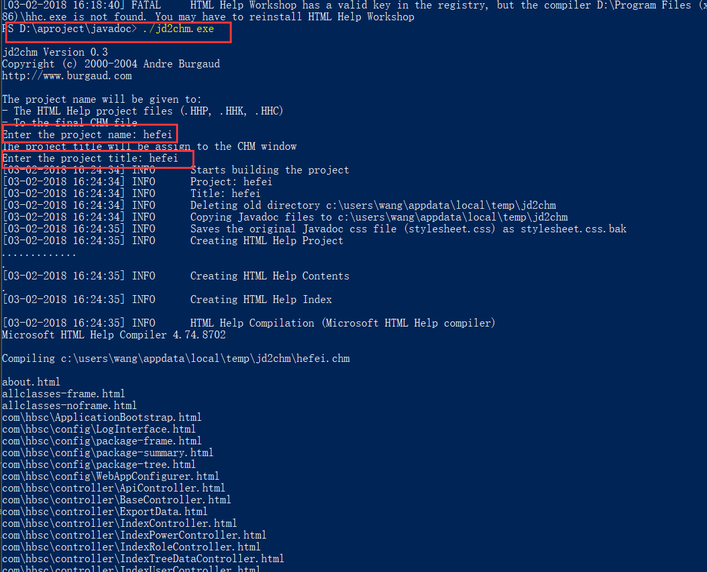

1. 下载jd2chm.exe
2. 放到生成javadoc的目录下(包含index.html文件)

3. 打开cmd进入到javadoc目录,并执行./jd2chm.exe

4. 上面会报错 (找不到系统指定文件) 这时需要下载HTML Help Workshop
https://msdn.microsoft.com/en-us/library/windows/desktop/ms669985(v=vs.85).aspx

5. 安装下载下来的文件放在默认的安装路径(c:/Program Files /HTML Help Workshop)下
6. 再执行输入project 名字 和 tilte 名字就可以成功了

