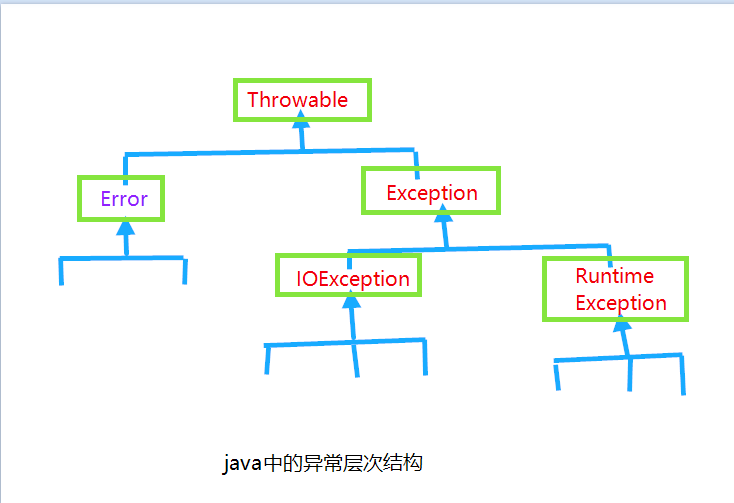

  用户在使用程序出现错误导致某些操作没有完成,程序应该 :
- 返回到一种安全状态,并能够让用户执行一些其他的命令;或者
- 允许用户保存所有操作的结果,并以适当的方式终止操作.

### 异常分类

- Error java运行时系统的内部错误和资源耗尽错误
- RuntimeException的异常包含下面几种情况
  * 错误的类型转换
  * 数组访问越界
  * 访问空指针
- 不是派生于RuntimeException 异常包括 :
  * 试图在文件尾部后面读取数据
  * 试图打开一个不存在的文件
  * 试图根据给定的字符串查找Class对象,而这个字符串表示的类并不存在

*如果出现RuntimeException 异常,那么就一定是你的问题*.

java语言规范将派生于Error 类或 RuntimeException类的所有异常称为未检查(unchecked)异常
,所有其他的异常称为已检查(check)的异常.编译器将检查是否为所有的已检查异常提供了异常处理器.

#### 1. 声明已检查异常
  一个方法不仅需要告诉编译器需要返回什么值,还要告诉编译器有可能发生什么错误.例如,一段读取文件的
  代码知道有可能读取的文件不存在,或者内容为空,因此,试图处理文件信息的代码就需要通知编译器可能会抛出IOException类的异常.
  方法应该在其首部声明所有可能抛出的异常.这样可以从其首部反映出这个方法可能抛出哪类已检查的异常.
  例如,FileInputStream类的构造器声明 :
```java
    public FileInputStream(String name) throws FileNotFoundException
```
  下面4种情况应该抛出异常 :
  1) 调用一个抛出已检查的方法,例如,FileInputStream类的构造器声明
  2) 程序运行过程中发现错误,并且利用throw语句抛出一个已检查异常
  3) 程序出现错误,例如NullPointerException
  4) java虚拟机和运行库出现的内部错误
  如果出现前两种情况之一,则必须告诉调用这个方法的程序有可能抛出异常.
#### 2.
