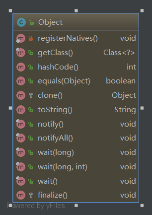

# Object源码



```java
public class Object {

    private static native void registerNatives();
    static {
        registerNatives();
    }
    /**
    * 返回此Object的运行时类
    */
    public final native Class<?> getClass();
    /*
    hashCode 的常规协定是：
    1.在应用程序执行期间，如果一个对象用于equals()方法的属性没有被修改的话，
    那么要保证对该对象多次返回的hashcode值要相等。
    2.如果2个对象通过equals()方法判断的结果为true，那么要保证二者的hashcode值相等。
    3.如果2个对象通过equals()方法判断的结果为false，那么对二者hashcode值是否相等并没有明确要求。
    如果不相等，那么能够提升散列表的性能。
    */
    public native int hashCode();

    /*
    可以看出默认情况下equals进行对象比较时只判断了对象是否是其自身，当我们有特殊的“相等”逻辑时，则需要覆盖equals方法。
    equals方法的通用约定：
    自反性：对于任何非null的引用值x，x.equals(x)必须返回true。
    对称性：对于任何非null的引用值x和y，当且仅当y.equals(x)返回true时，x.equals(y)必须返回true。
    传递性：对于任何非null的引用值x、y、z，如果x.equals(y)返回true，并且y.equals(z)返回true，那么x.equals(z)也必须返回ture。
    一致性：对于任何非null的引用值x和y，只要equals的比较操作在对象中所用的信息没有被修改，多次调用x.equals(y)就会一致的返回ture，或者一致的返回false。
    非空性：对于任何非null的引用值x，x.equals(null)必须返回false。
    */
    public boolean equals(Object obj) {
        return (this == obj);
    }

    /*
    使用clone方法的优点：
    （1）速度快。clone方法最终会调用Object.clone()方法，这是一个native方法，本质是内存块复制，所以在速度上比使用new创建对象要快。
    （2）灵活。可以在运行时动态的获取对象的类型以及状态，从而创建一个对象。
    当然，使用clone方法创建对象的缺点同样非常明显：
    （1）实现深拷贝较为困难，需要整个类继承系列的所有类都很好的实现clone方法。
    （2）需要处理CloneNotSupportedException异常。Object类中的clone方法被声明为可能会抛出CloneNotSupportedException，
    因此在子类中，需要对这一异常进行处理。因此，我们如果想使用clone方法的话，需要非常谨慎。事实上，《Effective Java》的作者Joshua Bloch建议我们不应该实现Cloneable接口，而应该使用拷贝构造器或者拷贝工厂。
    */
    protected native Object clone() throws  CloneNotSupportedException;

    public String toString() {
        return getClass().getName() + "@" + Integer.toHexString(hashCode());
    }

    public final native void notify();

    public final native void notifyAll();

    public final native void wait(long timeout) throws InterruptedException;

    public final void wait(long timeout, int nanos) throws InterruptedException {
        if (timeout < 0) {
            throw new IllegalArgumentException("timeout value is negative");
        }

        if (nanos < 0 || nanos > 999999) {
            throw new IllegalArgumentException(
                                "nanosecond timeout value out of range");
        }

        if (nanos > 0) {
            timeout++;
        }

        wait(timeout);
    }

    public final void wait() throws InterruptedException {
        wait(0);
    }

     protected void finalize() throws Throwable { }

}
```
