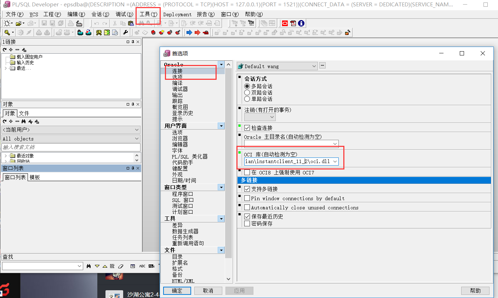
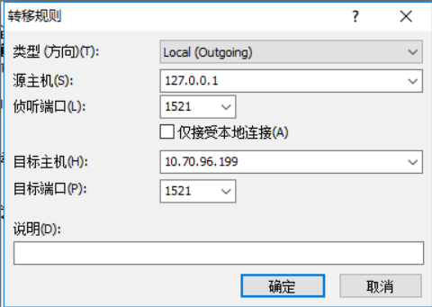

### 1. navicat 远程连接oracle

1. 安装Navicat premium 32位
2. 配置 工具 --> 选项 --> OCI --> D:\ruanjian\instantclient_11_2\oci.dll (32位的)
    instantclient-basic-win32-11.2.0.1.0.zip(解压之后)

### 2. plsql 远程连接oracle

1. 安装plsql
2. 配置工具选项    D:\ruanjian\instantclient_11_2\oci.dll
3. 

epsdba/epsdba@(DESCRIPTION =(ADDRESS = (PROTOCOL = TCP)(HOST = 127.0.0.1)(PORT = 1521))(CONNECT_DATA = (SERVER = DEDICATED)(SERVICE_NAME = oseb)))

转发 :

