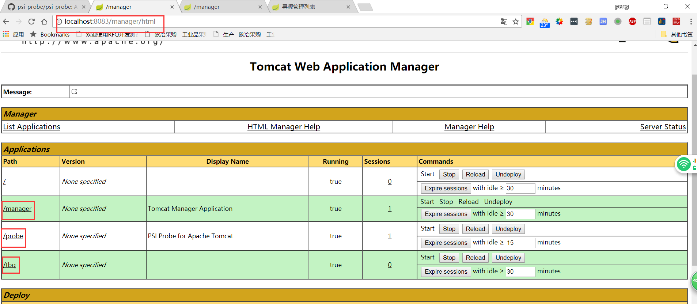

1. 到https://github.com/psi-probe/psi-probe clone下来
    ```
    git clone https://github.com/psi-probe/psi-probe
2.  进入到psi-probe目录
   使用maven打包 :
      ```
        mvn package
      ```
3. 在web/target/probe.war 找到probe包

4. 配置tomcat-user.xml文件 (CATALINA_HOME/conf/tomcat-users.xml)
  ```xml
  <role rolename="manager-jmx"/>
  <role rolename="manager-script"/>
  <role rolename="manager-gui"/>
  <role rolename="manager-status"/>
  <role rolename="poweruser"/>
  <role rolename="probeuser"/>
  <user username="tomcat" password="tomcat" roles="manager-gui,manager-status,manager-script,manager-jmx,poweruser,probeuser"/>
  ```
  在配置tomcat-users.xml时，还需要加入poweruser等角色，才可以正常使用，不然也是403Forbidden。
5. 在idea配置tomcat时加入probe.war包
    登录http://localhost:8083/manager/html 页面 (端口根据实际情况改,用户名和密码都是tomcat(tomcat-user.xml在上面的的配置中设置的))
    
6. 进入probe可以看到管理的页面
   下面国旗图标可以切换语言
7. 日志标签可以看到日志
