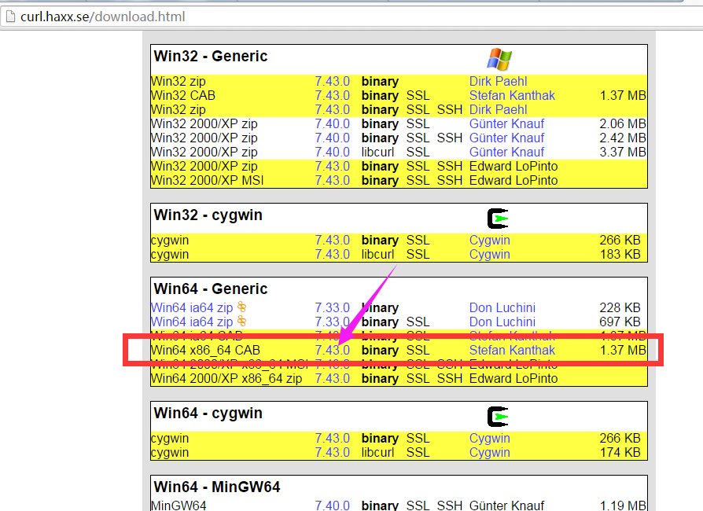
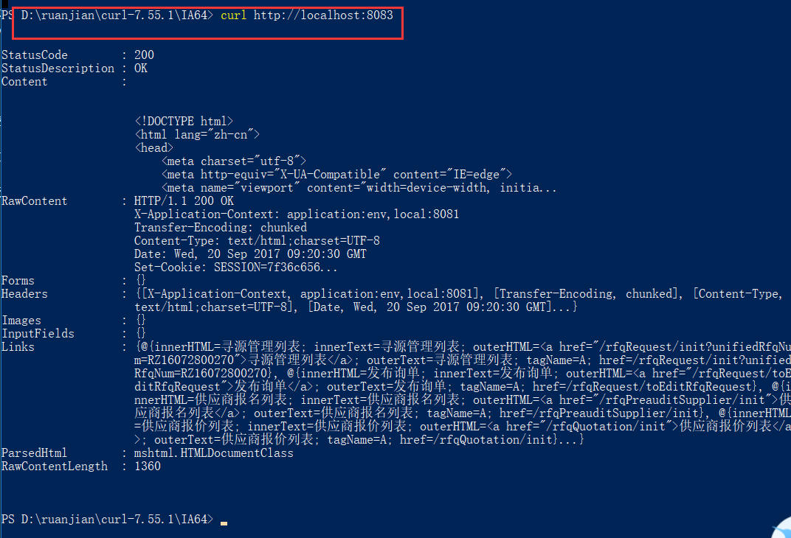
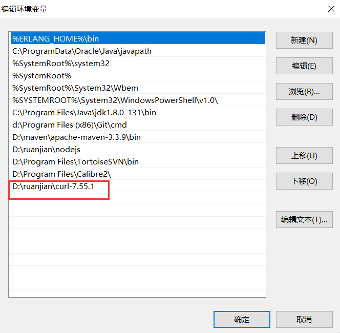

## 1.在官网处下载工具包：http://curl.haxx.se/download.html

## 2.
### 使用方式一：在curl.exe目录中使用

　　解压下载后的压缩文件，通过cmd命令进入到curl.exe所在的目录。

　　由于博主使用的是windows 64位 的系统，因此可以使用IA64下的curl.exe工具。

　　进入到该目录后，执行curl http://localhost:8083 测试：

### 使用方式二：放置在system32中

　　解压下载好的文件，拷贝I386/curl.exe文件到C:\Windows\System32

　　然后就可以在DOS窗口中任意位置，使用curl命令了。

### 使用方式三：配置环境变量

　　在系统高级环境变量中，配置

　　CURL_HOME ----- "你的curl目录位置\curl-7.43.0"

　　path ---- 末尾添加 “;%CURL_HOME%\I386”

　　这样与上面方式二的效果相同。

